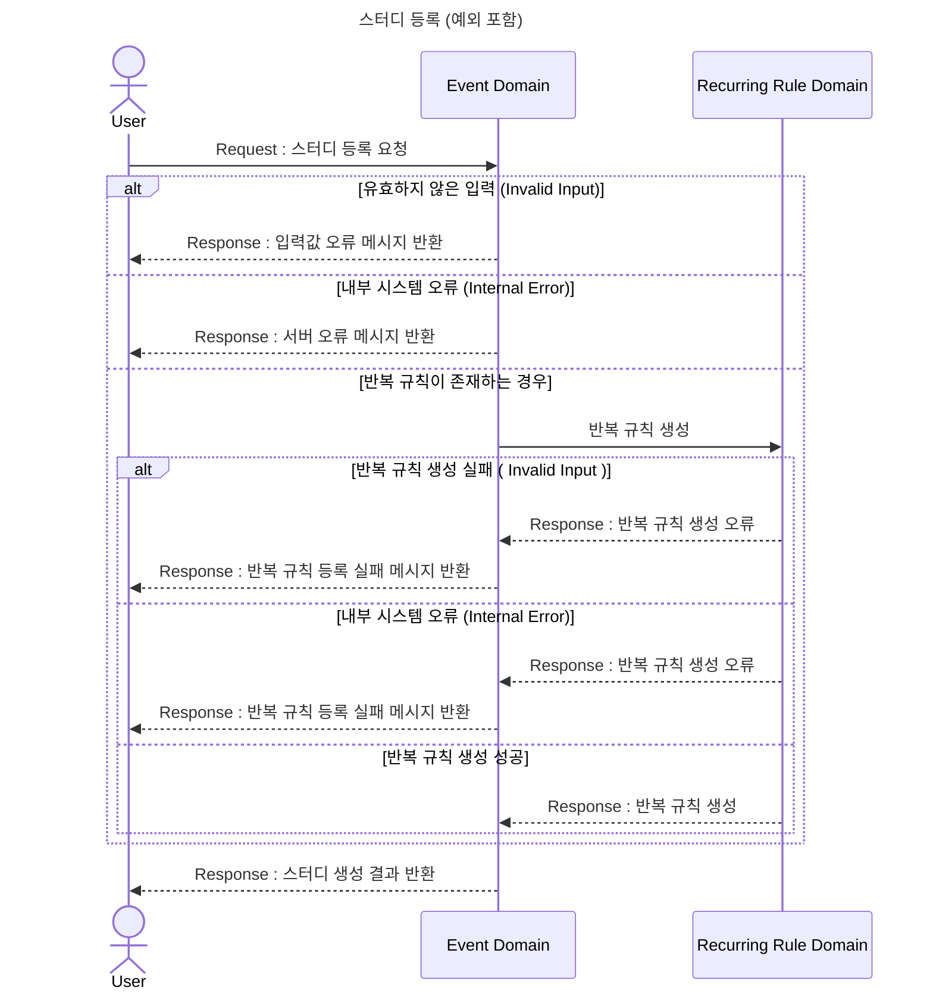

```mermaid
sequenceDiagram
    title 스터디 등록 (예외 포함)
    actor User as User
    participant study as Event Domain
    participant rule  as Recurring Rule Domain

    User->>study: Request : 스터디 등록 요청
    alt 유효하지 않은 입력 (Invalid Input)
        study-->>User: Response : 입력값 오류 메시지 반환
    else 내부 시스템 오류 (Internal Error)
        study-->>User: Response : 서버 오류 메시지 반환
        
    else 반복 규칙이 존재하는 경우
        study->>rule : 반복 규칙 생성 

        alt 반복 규칙 생성 실패 ( Invalid Input )
            rule-->>study: Response : 반복 규칙 생성 오류
            study-->>User: Response : 반복 규칙 등록 실패 메시지 반환
        else 내부 시스템 오류 (Internal Error)
            rule-->>study: Response : 반복 규칙 생성 오류
            study-->>User: Response : 반복 규칙 등록 실패 메시지 반환
        else 반복 규칙 생성 성공 
            rule-->>study: Response : 반복 규칙 생성 
        end
    end

    study-->>User: Response : 스터디 생성 결과 반환 
```