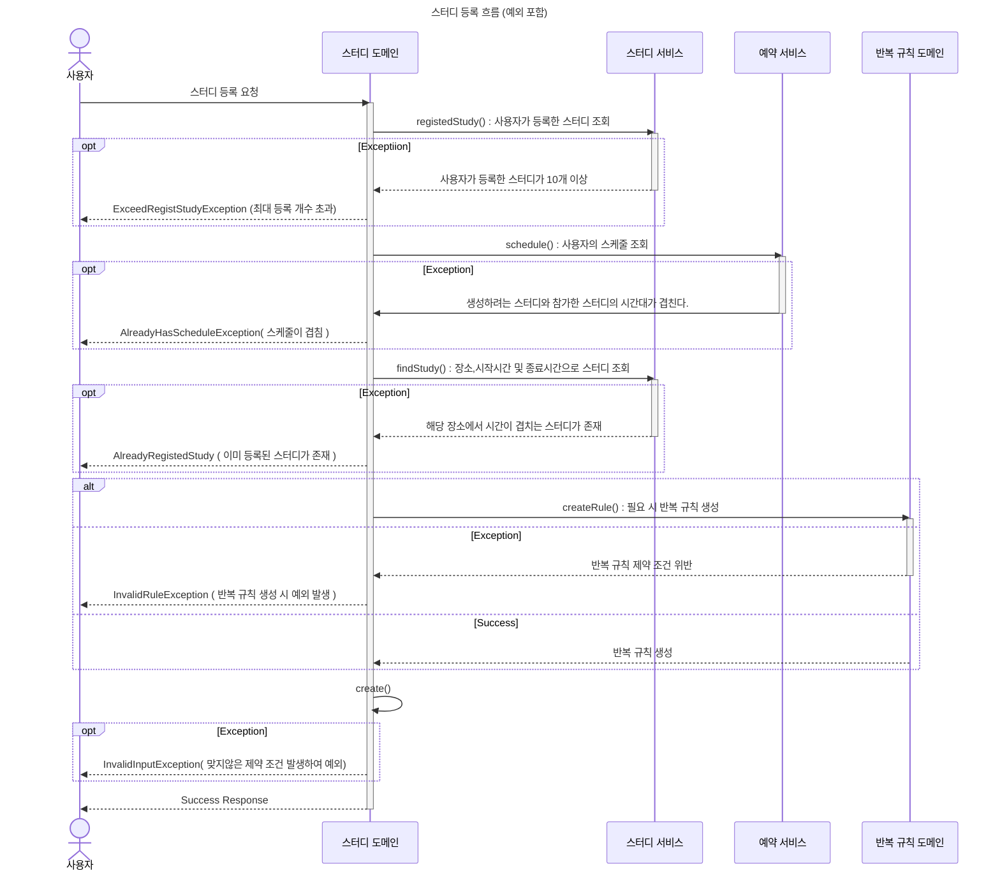

```mermaid
sequenceDiagram
    title 스터디 등록 흐름 (예외 포함)
    actor User as 사용자
    participant sd as 스터디 도메인
    participant ss as 스터디 서비스
    participant rs as 예약 서비스
    participant rd as 반복 규칙 도메인

    User->>sd: 스터디 등록 요청
    activate sd
    sd->>ss: registedStudy() : 사용자가 등록한 스터디 조회 
        activate ss
        opt Exceptiion
            ss-->>sd: 사용자가 등록한 스터디가 10개 이상
            deactivate ss
            sd-->>User: ExceedRegistStudyException (최대 등록 개수 초과)
        end    
    
    sd->>rs : schedule() : 사용자의 스케줄 조회 
        activate rs
        opt Exception   
            rs->>sd: 생성하려는 스터디와 참가한 스터디의 시간대가 겹친다.
            deactivate rs
            sd-->>User: AlreadyHasScheduleException( 스케줄이 겹침 )
        end

    sd->>ss: findStudy() : 장소,시작시간 및 종료시간으로 스터디 조회
    activate ss 
    opt Exception
            ss-->>sd: 해당 장소에서 시간이 겹치는 스터디가 존재 
            deactivate ss
            sd-->>User: AlreadyRegistedStudy ( 이미 등록된 스터디가 존재 )
    end 


    alt 
        sd->>rd: createRule() : 필요 시 반복 규칙 생성         
    activate rd
    else Exception
        rd-->>sd: 반복 규칙 제약 조건 위반 
        deactivate rd
        sd-->>User: InvalidRuleException ( 반복 규칙 생성 시 예외 발생 )
    else Success
        rd-->>sd: 반복 규칙 생성
    end

    sd->>sd: create()        
    opt Exception
        sd-->>User : InvalidInputException( 맞지않은 제약 조건 발생하여 예외)
    end
    sd-->>User : Success Response

    deactivate sd

```